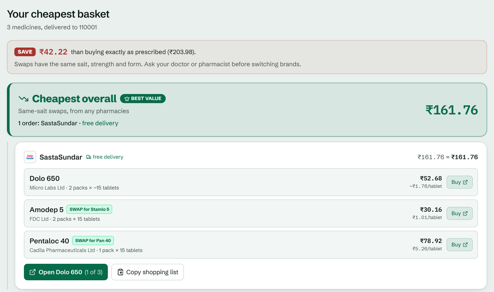

# PharmaWatch

Type a medicine, or a whole prescription, and your PIN code. PharmaWatch shows what it costs
**delivered to your door** from 10 Indian online pharmacies (9 with verified delivery fees), finds **brands with the same composition**
that are cheaper, and works out the **cheapest way to buy everything**, delivery fees included.



It is built on [SerpApi](https://serpapi.com) (Google Shopping + Google product pages), a Redis cache
that decides when *not* to call SerpApi, an index of 246,046 Indian medicines that says which brands
share a composition, and Gemini, used for one narrow job: reading misspellings.

---

## Contents

- [How a search works](#how-a-search-works)
- [A whole prescription](#a-whole-prescription)
- [Compared with the pharmacies' own suggestions](#compared-with-the-pharmacies-own-suggestions)
- [Medicine data](#medicine-data)
- [Keeping the LLM grounded](#keeping-the-llm-grounded)
- [The cache](#the-cache)
- [Problems we hit, and what fixed them](#problems-we-hit-and-what-fixed-them)
- [What one search costs](#what-one-search-costs)
- [Setup](#setup)
- [Use it from Claude or Codex (MCP)](#use-it-from-claude-or-codex-mcp)
- [Tests](#tests)
- [Project layout](#project-layout)
- [Known limits](#known-limits)

---

## How a search works

Everything after the first step runs in parallel. Results reach the browser as each piece finishes.

```
 t=0  what is "Stamlo 5"?  medicine index, ~1 ms, 0 credits → Amlodipine 5mg tablet, 281 brands
      │   ("paracetamol" without a strength → the user picks one first; nothing is searched)
      │
      └─ Google Shopping: "Stamlo 5 price" ──▶ main list (only real Stamlo 5 listings)
            │                                 └─▶ product page link for the cheapest (parallel)
            │
            ├─ "Amlodipine 5mg tablet generic"               ─┐  pool every search
            ├─ the same + a pharmacy's name                   ├▶ every brand of the salt found anywhere,
            └─ "Amlopres 5" (a discounted-generic brand)     ─┘   per tablet, delivery included
                                                                ▶ link for the cheapest alternative
```

1. **What the search names.** `pharmawatch/medicines.py` looks the words up in an index of **246,046
   Indian medicines** (see [Medicine data](#medicine-data)): a brand ("Stamlo 5"), a salt
   ("Gliclazide 80mg") or a name that needs a strength first ("paracetamol", "Dolo"). Spelling is
   corrected against the index ("dollo 650" → Dolo 650).
2. **Main search.** Google Shopping via SerpApi. Listings are parsed, mapped to one of the 10
   pharmacies we cover, and **delivery cost for your PIN** is added: zone lookup (metro / tier 2 / tier 3 /
   remote / unserviceable), free-delivery thresholds, fee slabs and platform fees. The list is ranked
   by the delivered price, not the shelf price. For a salt search the main list is every brand of
   that exact composition.
3. **Substitute searches.** Every brand with the same composition key (salts, strengths, form,
   release type) is a substitute. Up to three searches are added, each chosen for reach (see
   [problem 6](#6-the-cheapest-generics-are-cheap-only-after-a-pharmacys-discount)):
   - the salt + "tablet generic", which steers Google to the discounted generics pharmacies sell;
   - the same words + a pharmacy's name, which surfaces that pharmacy's own generics (single-salt
     medicines only);
   - the brand of the salt from a maker whose generics pharmacies discount most (a salt search
     without one gets the brand whose maker has the widest range).

   When Google's answer to a brand has none of it, one more search adds the form word ("Pan 40
   tablet", see [problem 7](#7-google-answered-some-brands-with-other-brands-only)).
4. **Pooling.** Every listing from every search is checked against **every** brand of the
   composition, so brands nobody searched for are compared too (see
   [problem 3](#3-a-brands-own-search-often-doesnt-return-that-brand)).
5. **Comparison.** Per-tablet price, delivery included. Missing pack sizes are estimated from the
   brand's other listings, then from its usual pack in the index, and flagged.
6. **Direct links.** Resolving a listing to the pharmacy's own product page costs a SerpApi call, so it
   is done up front only for the cheapest main listing and the cheapest alternative; any other listing
   is resolved when it is clicked (1 credit, then cached for 24 h).

The browser receives four events: `main`, `main_update` (only if pooling found more listings),
`alternatives` and `main_links`, in whatever order they finish, or a single `choose` event when the
search needs a strength first.

---

## A whole prescription

Up to 8 medicines, each with an optional number of tablets (else one pack of the prescribed
medicine). Every line is resolved in the medicine index at once, a line without a strength
("paracetamol") asks for one and the rest carry on, and **every search of every line runs at the
same time**: 3 medicines take about as long as 1.

Then the basket is optimised as a whole (`pharmawatch/basket.py`). Each pharmacy charges delivery on
its own order total (1mg: ₹50 below ₹500, then free; Apollo: ₹93.22 below ₹199, then ₹7.08; Netmeds: ₹59,
₹29 from ₹250, free from ₹500), so buying each medicine where it is cheapest alone can cost more than
putting two in one order.

- Every same-composition offer covers the needed tablets in whole packs.
- Assignments of medicines to pharmacies are priced with the real delivery rules on each pharmacy's
  subtotal, by branch and bound: delivery fees are never negative, so item costs so far plus the
  cheapest possible remaining items bound any basket, and branches that can't win are cut. It is exact
  over the cheapest offer per pharmacy and medicine, checked against brute force on 200 random
  baskets. A random 8 medicines × 7 pharmacies (5.7 million assignments) takes under 0.1 s in the test;
  the 3-medicine example above took 4 ms.
- Two answers: **cheapest with same-salt swaps** and **exactly as prescribed**, plus the best single
  pharmacy and the saving (compared on the medicines both can cover).
- Direct product links are resolved only for the offers the basket picked.

The UI's *Whole prescription* tab streams each medicine as it finishes; *Under the hood* shows every
lookup of every line and how many assignments the optimiser priced. The same basket is available as
`GET /api/prescription/stream`, `GET /api/prescription` and the MCP tool `plan_prescription`.

## Compared with the pharmacies' own suggestions

Online pharmacies often show a "cheaper alternative" on a medicine's page. PharmaWatch doesn't set out
to beat any one pharmacy. It puts the offers of all 10 side by side, so the customer can see the
cheapest one available to them, wherever it is sold. A pharmacy's own suggestion is a useful check
on that: if it is cheaper than anything PharmaWatch found, a search missed something.

`scripts/reference_check.py` runs this check on 15 common medicines and 4 prescriptions. It reads a
pharmacy's suggested alternative from its product page (a test reference only: the product itself gets
every price from SerpApi). It then compares that with PharmaWatch's cheapest same-composition offer,
per tablet, delivery included, and writes the result to `scripts/reference_report.md`.

These suggestions are mostly discounted generics that list prices can't predict, which is why each
medicine gets the extra searches described in [How a search works](#how-a-search-works) (see
[problem 6](#6-the-cheapest-generics-are-cheap-only-after-a-pharmacys-discount)). The last full run
predates the switch to verified delivery fees ([problem 5](#5-shelf-price-is-not-what-you-pay)), so
its score is not quoted here until it is rerun.

## Medicine data

Substitutes come from the **Indian Medicine Dataset** (253,973 medicines, MIT licence,
[junioralive/Indian-Medicine-Dataset](https://github.com/junioralive/Indian-Medicine-Dataset)).
`scripts/build_medicine_index.py` turns it into `pharmawatch/drug_db/medicines.sqlite.gz` (7 MB):
246,046 products that aren't discontinued, 17,028 compositions and 7,641 manufacturers.

Each product gets a **composition key**: its salts with strengths, its form and its release type.
Products with the same key are interchangeable brands; anything else is a different medicine.

| Search | Key | Brands | Not in the group |
|---|---|---|---|
| Gliclazide 80mg | `gliclazide:80mg\|tablet\|` | 116 (Glizid 80, Diamicron 80, Glycigon ...) | Glizid-M, Reclimet (+ metformin) |
| Sitagliptin 50mg | `sitagliptin:50mg\|tablet\|` | 54 (Januvia 50, Istavel 50, Sitacip 50 ...) | Istamet (+ metformin), Setalin 50 (sertraline) |
| Glyciphage SR 500 | `metformin:500mg\|tablet\|sr` | SR brands only | Glyciphage 500 (immediate release) |

The list prices (MRP) in the dataset only decide which brands are worth searching. Every price shown
comes live from SerpApi.

## Keeping the LLM grounded

Gemini is optional, and it **never sees web data** or names a medicine on its own. It has one job:
when a misspelt search has **two or more** possible corrections in the index ("dollo 650"), pick which
one the user meant **from those candidates**. A search that is spelt right, or has only one possible
correction, never reaches Gemini.

| Step | What happens |
|---|---|
| Input | The search + up to 4 index candidates (closest spellings of the first word), each with its composition |
| Output | JSON with a fixed schema at temperature 0: the `choice` (a candidate number or null) and a one-line `reason` |
| Validation (code) | The choice must be one of the candidates. Anything else, null included, falls back to the closest spelling |
| Timing | Runs in parallel with the main Google Shopping search; the substitute searches start once both are done |
| Cost | 0 SerpApi credits. Cached in Redis for 30 days; the key includes a hash of the index and the prompt |
| Failure | Model chain (`gemini-2.5-flash` → `gemini-3.5-flash-lite` → `gemini-2.5-flash-lite` → `gemini-flash-latest`, 30 s each) on quota, overload or timeout. With no key, or if every model fails, the closest spelling is used |

Everything else (brand vs salt, which brands are substitutes, which listing is which brand) is
deterministic code over the index.

---

## The cache

`serpapi_cache/` is a drop-in replacement for `serpapi.Client.search()`:

```python
from serpapi_cache import SerpApiCache
cache = SerpApiCache()                                    # Redis at REDIS_HOST:REDIS_PORT
result = cache.search({"engine": "google_shopping", "q": "Dolo 650 price"})
```

The hosted app uses Render Key Value (Redis-compatible), wired to the API by `render.yaml`. Locally it
is the Redis container from `docker compose`.

Each lookup goes through up to three steps:

1. **Exact match.** The normalised query (case, spacing, `500 mg` → `500mg`) is hashed and looked up.
   One Redis `GET`, no model involved.
2. **Semantic match.** The query is embedded (`all-MiniLM-L6-v2`, 384 dimensions) and compared by
   cosine similarity with everything cached. A score ≥ 0.88 is a hit.
3. **Dosage guard.** A semantic hit is refused if the numbers differ: "Metformin 500mg" never gets
   "Metformin 1000mg" results.

On top of that:

- **Same params only.** A semantic hit is only served from an entry fetched with the same other params
  (page, filters, language, `json_restrictor`), checked by a stored hash of those params. The embedding
  only sees the query text, so without this "Dolo 650, page 2" could get page 1's results.
- **Thin results expire in 1 h.** Google sometimes answers "Stamlo 5 price" with other brands only. A
  main search that finds fewer than 3 real listings of the medicine is cached for 1 h instead of 24 h
  (`ttl_for` in `SerpApiCache.search`), so a bad response doesn't stick for a day.
- **`exact_only=True`** skips step 2. Brand names the index knows, and every substitute search, are
  looked up this way (see
  [problem 1](#1-a-semantic-cache-cant-tell-two-brands-apart)).
- **Background writes.** A search that calls SerpApi returns immediately; the Redis write happens on a
  writer thread. The next search waits for any write still in flight (a few ms), so a repeat query
  always hits.
- **Call log.** Every lookup records engine, query, outcome (exact / semantic / API call), time taken,
  whether it cost a credit, and *why* it happened ("substitute search: Amlokind 5"). The UI shows it live.
- **Redis down?** The cache runs in passthrough mode: every search goes to SerpApi and the app keeps working.
  It tries to reconnect every 30 s, so caching resumes on its own.
- **Credit budget.** With `DAILY_CREDIT_BUDGET` set (30 on the hosted app), SerpApi calls are counted
  per UTC day in Redis, so a restart doesn't reset the count. Cached answers are always served.
- **Gemini decisions** are kept in the same Redis for 30 days.
- **`json_restrictor`.** PharmaWatch asks SerpApi only for the fields it reads (`pharmawatch/search.py`),
  so less is transferred and cached. The restrictor is part of the cache key, because a restricted
  response has a different shape. It is not part of the embedded text, so similarity scores are unchanged.

Measured: SerpApi calls took **1.7–12 s**; cache hits took **1–20 ms**. With `json_restrictor`, a
Google Shopping entry in Redis went from **187–282 KB to 111–125 KB** (40 results; the page tokens
needed for direct links are 58% of what is left), and a product-page entry from **~27 KB to 212 bytes**.

---

## Problems we hit, and what fixed them

Each of these came from a real run.

### 1. A semantic cache can't tell two brands apart

"Calpol 650 price" and "Dolo 650 price" are close in meaning and share the same number, so the dosage
guard lets them through. It happened live: "Atorbest 10 price" was answered from another atorvastatin
brand's cached search (same dose, similarity above 0.88), and the main list came back empty.

**Fix:** a search the index identifies as a brand, and every substitute search, is looked up by exact
name only (`exact_only=True`). Their results are still stored with an embedding, so free-text and salt
searches can reuse them.

### 2. Google Shopping returns look-alike medicines

A search for **Stamlo 5** returned 22 pharmacy listings. Only **8** were Stamlo 5. The rest included
**Esta 5** and **Stalopam 5** (escitalopram, an antidepressant), Stamlo **Bis**, Stamlo **D**, Stamlo
**Beta** and Met Stamlo (all combination drugs). Two of the 5 product-page lookups, each costing a
credit, went to the antidepressant.

**Fix:** a listing counts only if its title is the brand and strength. It is rejected when it carries:

- a variant suffix the brand doesn't have (SR, AT, Bis, H, Plus…);
- a second dose: "Telma AZ 40mg **8mg**", "Amlokind AT 5/**50**mg" (doses that add up to the
  brand's own, like Augmentin 625 = 500 mg + 125 mg, are fine);
- a short word between the brand and its dose: "Telma **NB** 40MG", "Telmikind **AMH** 40MG".

Checked against every cached search: the last two rules rejected exactly the 5 combination products
and **no correct listing**.

### 3. A brand's own search often doesn't return that brand

In **4 of 7** brand searches, Google Shopping returned **zero** listings of the searched brand from
the pharmacies we cover. Dolo 650, Amlopres 5, Amtas 5 and Glyciphage SR 500 came back as other
strengths or other brands. Yet Amlopres 5 listings *did* appear in the Stamlo 5 and Amtas 5 searches.

**Fix:** every listing of every search in the run is matched against every brand of the composition
(pooling), so Amlopres 5 is priced from the other searches at no extra cost.

### 4. Titles often don't say how many tablets

"Stamlo 5MG Tablet ₹66.02". Is that 15 tablets or 30? Without a pack size there is no per-tablet
price, and the cheapest offer in that run was being skipped.

**Fix:** estimate the pack size from the same brand's other listings, choosing the size that gives a
consistent per-tablet price. For Telma 40, 1mg's ₹99.80 is a **15**-strip (₹6.65 / tablet, close to
the brand's ₹6.43 median), not a 30, even though 30 is the more common size. Dawaa Dost's product
URL for its ₹91 Telma 40 (`…telma-40mg-tablet-15s`) confirms that this price range is a 15-strip.
Every estimate is flagged (`pack_estimated`, `estimated`) and shown with a "~" in the UI. Implausible
estimates (outside 0.5–2× the median) are not used.

### 5. Shelf price is not what you pay

Apollo's Stamlo-5 15's costs ₹40 on the shelf and **₹133.22** delivered to 110001 (₹93.22 delivery below
₹199). Ranking by delivered price, not shelf price, changes which pharmacy wins.

**Where the fees come from.** Every fee in `notes/postal_codes_delivery_rules.json` names its source: a
checkout cart (Apollo, PharmEasy, 1mg, Truemeds) or the shipping line on the pharmacy's Google product page
(Netmeds, SastaSundar, Chemist180, Dawaa Dost, Medizinhub). Pharmacies whose fees we could not verify were
removed rather than priced on a guess. Medplus does not publish a fee, so its listings show "fee not
published" and never win a comparison. The rules file is also the only list of pharmacies: adding one is one
entry there (fees, plus the name and words that recognise it in Google Shopping), and
`scripts/test_rules_integrity.py` checks that every entry is recognised and priced.

### 6. The cheapest generics are cheap only after a pharmacy's discount

On the pharmacies' own pages, the "cheaper alternative" for Dolo 650, Stamlo 5 and Atorbest 10 was a
Cipla brand each time (Paracip 650, Amlip 5, Lipvas 10). By list price these are **expensive**:
Paracip ranks 449th of 500 paracetamol-650 brands, Amlip 243rd of 281, Lipvas 557th of 655. They are
cheap only after the pharmacy's discount (Amlip: ₹3.24 list, ₹1.35 sold), so no rule over list prices
finds them, and Google's plain salt search didn't return them. Other suggestions were a pharmacy's own
discounted generics (for Pan 40, Thyronorm 50, Rosuvas 10). Their makers have nothing in common, and
Google lists them only when the query names the pharmacy.

**Fix:** extra searches chosen for reach, not price. Every result is pooled and checked against the
whole composition group:

- the salt + "tablet generic", which steers Google to discounted generics ("Atorvastatin 10mg tablet
  generic" found Torvason 10, which the plain salt search missed);
- the brand with the largest family from the maker pharmacies discount most ("Paracip 650", not
  the thin "Cipmol 650": 29 listings of 10 same-salt brands);
- for single-salt medicines, the generic search with a pharmacy's name added ("Pantoprazole 40mg
  tablet generic" + the name found Pantopraz 40, which no other query returned).

Combinations stay a gap: the pharmacy-named search returns nothing for them.

### 7. Google answered some brands with other brands only

"Pan 40 price" returned 24 listings of other pantoprazole brands and not one Pan 40; "Atorbest 10
price" returned Atorbest 20 only. The prescribed brand then looked unavailable, and the basket could
not compare it.

**Fix:** when a brand's own search has none of it, one more search adds the form word ("Pan 40
tablet": 5 listings of Pan 40; "Atorbest 10 tablet": 6). In a 5-medicine prescription this turned
"compared on 3 of 5 medicines" into all 5.

### 8. Step by step was slow

The 9 SerpApi calls of the Telma 40 run add up to **33.8 s** if made one after another. In parallel,
main results arrived at **2.6 s**, generic alternatives at **5.2 s**, and all product links at
**8.1 s**. Alternatives don't wait for the main product links, which are the slowest step.

## What one search costs

| Call | SerpApi credits | When |
|---|---|---|
| Main search | 1 | Always, unless cached (24 h; 1 h when Google returned fewer than 3 real listings) |
| Brand retry | 0–1 | Only when Google's answer to a brand has none of it ("Pan 40" → "Pan 40 tablet") |
| Generic salt search | 1 | "Amlodipine 5mg tablet generic" for Stamlo 5 |
| Pharmacy-named generic search | 0–1 | The same + a pharmacy's name (today `chemist180`); single-salt medicines only |
| Discounted-generic brand | 0–1 | The largest-family brand of the salt from the maker pharmacies discount most ("Paracip 650"); a salt search without one gets the brand with the widest maker range |
| Product-page link, main list | 0–2 | The cheapest real match, only when links are on; once more if pooling changes which listing is cheapest |
| Product-page link, alternatives | 0–1 | The cheapest alternative that is cheaper than the searched brand, only when links are on |
| Product page on click | 1 per listing | Any other listing, when its Visit site is clicked; then cached 24 h |
| Gemini | 0 SerpApi credits | Only for misspellings with several possible readings, then cached |
| A search without a strength ("paracetamol") | 0 | The user picks a strength first |

A new single-salt brand typically costs **4** credits with links off (3 for a combination), plus 1 when
the brand retry runs. With links on it can reach 8. Repeating it within 24 hours costs **0**, and a later
search that shares a salt reuses the cached searches. A prescription costs the sum of its new medicines,
with links resolved only for the offers the basket picked.

---

## Setup

### Quickstart with Docker (one command)

Requirements: Docker. Put your keys in `.env` in the repo root (git-ignored):

```bash
SERP_API_KEY=...
SERP_API_KEY_2=...
GEMINI_API_KEY=...
```

The second SerpApi key is optional. Docker Compose uses it only after the first key runs out.

Then:

```bash
docker compose up --build
```

Open http://localhost:3000. The API is on http://localhost:8000.

- Three containers: Redis (append-only file, data kept in a volume), the API and the UI. Each has a
  healthcheck, and the UI starts once the API is healthy.
- The embedding model is downloaded during the build, so the first search doesn't wait for it.
- Keys are read from `.env` when the containers start and are never copied into an image
  (`.dockerignore` excludes `.env`). Both app containers run as non-root users.
- The first build downloads about 1 GB (CPU-only PyTorch) and takes a few minutes. The API image is
  about 2.2 GB and the UI image about 330 MB.

### Local development

Requirements: Python 3.10+, Docker (for Redis), Node 20+ (for the web UI).

```bash
# 1. Redis only (data persists in a Docker volume)
docker compose up -d redis

# 2. Python dependencies
pip install -r requirements.txt

# 3. Keys: .env in the repo root (git-ignored)
SERP_API_KEY=...
GEMINI_API_KEY=...
# optional: GEMINI_MODEL=gemini-2.5-flash,gemini-2.5-flash-lite
# optional: MAX_CONCURRENT_SEARCHES=4  SEARCH_TIMEOUT_S=90  SERPAPI_TIMEOUT=30
# optional: UI_ORIGINS=http://localhost:3000   (CORS)
# optional: REDIS_HOST=localhost  REDIS_PORT=6379

# 4. API
uvicorn api.main:app --port 8000

# 5. Web UI (http://localhost:3000)
cd web && npm install && npm run dev
```

### Hosting (Render free plan)

`render.yaml` is a Render Blueprint (New → Blueprint → this repo). It creates:

| Service | What it is |
|---|---|
| `pharmawatch-cache` | Render Key Value (Redis-compatible), private to the API |
| `pharmawatch-api` | The FastAPI app from `api/Dockerfile.render`, serving the website's API and the public MCP connector at `/mcp`. The embedding model runs on ONNX instead of PyTorch, so it fits the 512 MB free instance |
| `pharmawatch-static` | The web UI as a Next.js static export (`NEXT_OUTPUT=export`), served as plain files |

Keys (`SERP_API_KEY`, `GEMINI_API_KEY`) are entered in the Render dashboard and never committed. The
Blueprint also sets `DAILY_CREDIT_BUDGET=30` and `MAX_CONCURRENT_SEARCHES=3`.

Free web services sleep after 15 minutes without traffic, and Render gives 750 free instance hours a month.
A static site uses none, so the API alone can stay up all month (about 744 hours).
`.github/workflows/keep-awake.yml` calls `GET /api/health` every 10 minutes (0 SerpApi credits) to keep it
awake; set the repository variable `API_URL` if the API's address changes.

### API endpoints

| Endpoint | What it returns |
|---|---|
| `GET /api/search/stream?q=Stamlo 5&pincode=110001` | Server-Sent Events: `main`, `main_update`, `alternatives`, `main_links`, plus every SerpApi call live and a summary |
| `GET /api/search?q=Stamlo 5&pincode=110001` | The same search as one JSON response. 422 bad input, 429 busy, 504 deadline passed, 502 pipeline error (the last two still include partial results) |
| `GET /api/prescription/stream?items=[{"q":"Dolo 650","tablets":30}]&pincode=110001` | Server-Sent Events for a whole prescription (1–8 lines): each line as it progresses, then the basket |
| `GET /api/prescription?items=...&pincode=110001` | The same prescription as one JSON response |
| `GET /api/link/{link_id}` | Redirects to a listing's own pharmacy product page (1 credit the first time, cached 24 h), else the store search |
| `GET /api/health` | Redis status, model warm-up state, whether keys are configured (never the keys) |
| `GET /api/account` | SerpApi plan usage (free call, cached 30 s) |
| `GET /api/stats` | Cache hit rate, credits spent and saved in this process |
| `GET /api/cache/lab?q=...` | What the cache *would* do with a query: nearest cached queries, similarity, dosage guard. Read-only, 0 credits |
| `GET /api/cache/entries` | Everything in Redis, with time left |

### Guards

A new medicine can spend up to 8 credits (see [What one search costs](#what-one-search-costs)), so the API protects them:

- **Input is checked before anything runs.** A bad PIN or an empty query is refused and costs nothing.
- **At most `MAX_CONCURRENT_SEARCHES` (default 4) run at once.** More are refused with a clear message.
  A search keeps its slot until its pipeline finishes, even if the browser disconnects.
- **`SEARCH_TIMEOUT_S` (default 90)** caps how long a request waits; anything fetched so far is still
  returned and cached.
- **`SERPAPI_TIMEOUT` (default 30 s)** on every SerpApi request. The client's default is no timeout.
- **The live call log is trimmed** as soon as no running search can still need an entry, so a
  long-running server doesn't grow.

On the stream endpoint a refused search still answers `200` with an `error` event (`code`:
`invalid_query`, `invalid_pincode`, `busy`, `timeout`, `pipeline_error`) followed by `done`, because a
browser `EventSource` can't read an HTTP error body.

### Keys and secrets

- Keys live only in `.env`, which is git-ignored.
- The Gemini key is sent in a request header, not the URL.
- API responses report *whether* a key is configured, never its value.
- Errors from the SerpApi account lookup are reported without the request URL, which contains the key.

---

## Use it from Claude or Codex (MCP)

PharmaWatch is an [MCP](https://modelcontextprotocol.io) server, built on the official Python SDK, in two ways:

- **Public connector, nothing to install:** `https://pharmawatch-api-7wm1.onrender.com/mcp` (Streamable HTTP),
  served by the same process as the website's API. `server.json` describes it for the official MCP Registry as
  `io.github.b25cs1051-KUSH/pharmawatch`.
- **Local, over stdio:** `python mcp_server.py`, for Claude Desktop, Cursor and MCP Inspector with your own keys.

Every tool calls the same code as the web app's HTTP API (`api/main.py`), so input validation, the concurrency
limit, the search deadline, the daily credit budget and credit accounting are shared. An agent gets the same
answers a shopper gets on the website.

| Tool | What it does | Credits |
|---|---|---|
| `search_medicine(query, pincode, resolve_links=false)` | Listings ranked by what the buyer pays delivered to the PIN, cheaper same-salt brands with per-tablet savings, spelling correction, a strength prompt for names like "paracetamol" | ~4 for a new medicine, 0 from cache |
| `plan_prescription(medicines[{name, tablets?}], pincode, resolve_links=false)` | The cheapest way to buy a whole prescription: three plans (cheapest with swaps, one pharmacy, exactly as prescribed) as orders per pharmacy with delivery, the swap saving, a per-medicine comparison, and lines that need a strength | ~4 per new medicine, 0 from cache |
| `get_buy_link(listing_id)` | The listing's own pharmacy product page, resolved on demand: the same lookup as a Buy click in the web app (`/api/link/{id}`) | 1 the first time, then 0 for 24 h |
| `cache_lab(query, top=6)` | What the cache would do: exact key, nearest cached queries with cosine scores, the dosage guard | 0 |
| `cache_stats()` | Redis status, what is cached (by kind and size), credits spent vs saved in this server | 0 |

Prompts: `compare_medicine(medicine, pincode)` and `plan_my_prescription(prescription, pincode)`, which clients show
as ready-made actions.

Design choices:

- **Typed output and readable text.** Every tool publishes an `outputSchema` and returns `structuredContent`
  (all listings, ids, link types, savings, run summary) alongside a compact Markdown answer for the model's
  context. `response_format="json"` returns the structured data as the text too.
- **Links an agent can act on.** Every listing and basket item has a `listing_id` and a `link_type`
  (`product_page`, `store_search`, `google_shopping`). The agent calls `get_buy_link` only for the offer the user
  picks, instead of resolving every link up front. Only that pharmacy's page is returned, never another store's.
- **Schemas every client can read.** `$ref`/`$defs` are inlined, so clients that don't resolve references still
  see that a prescription item has `name` and `tablets`.
- **Credit-safe defaults.** `resolve_links` is off. The server instructions give the real costs and the workflow
  (search, show the delivered price, `get_buy_link` on request). `DAILY_CREDIT_BUDGET`, when set, caps MCP calls too.
- **Errors the model can act on.** A bad PIN or query, an unknown listing id, a busy server or a used-up budget
  come back as tool errors with a code (`invalid_pincode: ...`) before anything is spent. A search that fails
  halfway still returns what it found, marked "Search incomplete".
- **Clear output.** A spelling correction is stated ("Read \"dollo 650\" as Dolo 650"), estimated pack sizes
  are marked `~`, and swaps always carry "Same salt, strength and form. Ask a doctor or pharmacist before
  switching brands."
- **Annotations and progress.** `cache_lab` and `cache_stats` are read-only. The searches are open-world,
  non-destructive and idempotent. Both searches send MCP progress notifications for each lookup and stage.
- **Clean stdout.** The protocol runs on a private copy of stdout. Console prints from the cache and library
  warnings go to stderr, which MCP clients keep as the server log.

**Add the public connector:**

Nothing to install, no account with us, no keys: the connector runs on our server and uses our SerpApi key.

- **Claude** (claude.ai, Claude Desktop or the mobile app; Free, Pro, Max): Customize → Connectors → **+** →
  **Add custom connector**. Name it PharmaWatch, paste `https://pharmawatch-api-7wm1.onrender.com/mcp`, leave
  OAuth empty, click **Add**. Then, in a chat, turn it on from **+** → Connectors and ask, for example: *"Cheapest
  way to buy Dolo 650 × 30, Stamlo 5 and Atorbest 10 delivered to 382010?"* Free accounts can add one custom
  connector. On Team and Enterprise an owner adds it for the organisation first.
- **Cursor** (`~/.cursor/mcp.json`) or any client that takes a URL:
  `{"mcpServers": {"pharmawatch": {"url": "https://pharmawatch-api-7wm1.onrender.com/mcp"}}}`
- The host is on Render's free plan; a scheduled GitHub Actions job keeps it awake (see [Hosting](#hosting-render-free-plan)).
  If it was asleep anyway, the first call can take about a minute.
- **If a tool call fails:** a 503 means the service is suspended or deploying; "unknown listing id" from
  `get_buy_link` means the server restarted since the search, so search again; "budget" means the daily
  credit cap (`DAILY_CREDIT_BUDGET`) was reached: new searches wait until 00:00 UTC, cached ones still work.

**Run it locally instead** (`claude_desktop_config.json`; use your own absolute path and Python):

```json
{
  "mcpServers": {
    "pharmawatch": {
      "command": "python",
      "args": ["/absolute/path/to/Serp-Api-Hackathon/mcp_server.py"]
    }
  }
}
```

The server reads `.env` from the repo root, whatever directory the client starts it in. Redis is optional:
with it (`docker compose up -d redis`), repeat and similar searches are free from the cache; without it, every
tool call goes straight to SerpApi and the two cache tools report that Redis is down. The public connector
needs none of this.

**Code layout** (`pharmawatch_mcp/`; `mcp_server.py` is only the stdio launcher):

| Module | Job |
|---|---|
| `app.py` | The server instance and the instructions the model reads |
| `models.py` | Typed inputs and outputs; each output model is a tool's `outputSchema` |
| `convert.py` | The API's result dicts → output models (links, plans, spelling, savings) |
| `render.py` | Output models → compact Markdown |
| `tools.py` | The five tools, progress reporting, error mapping |
| `prompts.py` | `compare_medicine`, `plan_my_prescription` |
| `schemas.py` | `$ref` inlining for clients that don't resolve `$defs` |
| `stdio.py` / `remote.py` | Local transport / Streamable HTTP at `/mcp` on the API (`MCP_ALLOWED_HOSTS` for Host checks) |

**Codex CLI or IDE (local Windows setup):** Install `requirements.txt` into this project's `.venv`,
then register the same stdio server from PowerShell in the repo root. See the
[Codex MCP configuration guide](https://learn.chatgpt.com/docs/extend/mcp?surface=cli) for other platforms.

```powershell
$python = (Resolve-Path .venv\Scripts\python.exe).Path
$server = (Resolve-Path mcp_server.py).Path
codex mcp add pharmawatch -- $python $server
codex mcp get pharmawatch
```

In `~/.codex/config.toml`, add these values under the resulting `[mcp_servers.pharmawatch]` section:

```toml
default_tools_approval_mode = "writes"
tool_timeout_sec = 180
```

The approval setting prompts before `search_medicine` or `plan_prescription`, which can spend SerpApi
credits; `cache_lab` and `cache_stats` are marked read-only. The 180-second timeout covers the default
135-second prescription deadline. Raise it if `SEARCH_TIMEOUT_S` is increased. Codex stores the local
server with absolute paths, so register it again after moving the repo or rebuilding `.venv` elsewhere.

Restart the Codex IDE extension or open a new Codex session, then check `codex mcp list` or `/mcp` in
the Codex CLI. Ask “Use pharmawatch cache_stats to check Redis” for a zero-credit check, or ask
“Use pharmawatch to find the cheapest delivered price for Stamlo 5 to PIN 110001” for a live search.

**MCP Inspector:**

```bash
npx @modelcontextprotocol/inspector python mcp_server.py                     # web UI (local)
npx @modelcontextprotocol/inspector --transport http --server-url https://pharmawatch-api-7wm1.onrender.com/mcp
npx @modelcontextprotocol/inspector --cli python mcp_server.py --method tools/list
```

**Example.** Asking Claude or Codex *"Where is Telma 40 cheapest delivered to 110001, and is there a cheaper brand?"* makes
it call `search_medicine`. Real output from a cached run (links shortened):

```markdown
## Telma 40: delivered prices to PIN 110001

Cheapest delivered: **₹144.40** at 1mg (₹50 delivery · add ₹405.60 more for FREE delivery).

| # | Pharmacy | Product | Shelf price | Delivery | You pay | Arrives | Buy |
|---|---|---|---|---|---|---|---|
| 1 | 1mg | Telma 40 Tablet | ₹94.40 | ₹50 delivery · add ₹405.60 more for FREE delivery | ₹144.40 | 1-2 Days | [store search](…) · id `536999347923b066` |
| 2 | Apollo Pharmacy | Telma 40 mg Tablet 15's | ₹108.00 | ₹93.22 delivery · no free-delivery offer | ₹201.22 | 10-30 Mins / 1 Day | [store search](…) · id `d991be96b6f0bf3c` |
| 3 | Apollo Pharmacy | Telma 40 mg Tablet 30's | ₹216.50 | ₹7.08 delivery · no free-delivery offer | ₹223.58 | 10-30 Mins / 1 Day | [store search](…) · id `8bf7ca248a13cc06` |
| 4 | 1mg | Telma 40mg 30 Tablets by wellness forever | ₹189.00 | ₹50 delivery · add ₹311 more for FREE delivery | ₹239.00 | 1-2 Days | [store search](…) · id `fba8cd76406c76e2` |
| 5 | PharmEasy | Telma 40Mg Strip Of 30 Tablets | ₹166.87 | ₹130 delivery · add ₹763.13 more for FREE delivery · +₹13 platform fee | ₹309.87 | 1-2 Days | [store search](…) · id `ceea2f2e2248bcb8` |
| 6 | Medplus | Telma 40MG Tab | ₹216.72 | Delivers to PIN 110001, but delivery fee is not published | — | Same Day / Store Pickup | id `44c7115aa841ce5d` |

### Same-salt brands: Telmisartan 40mg tablet
Reference: Telma 40 mg Tablet 30's at Apollo Pharmacy, ₹223.58, ₹7.45/tablet delivered.

| Brand | Maker | Pharmacy | You pay | Per tablet | Pack | Saving | Buy |
|---|---|---|---|---|---|---|---|
| Telx 40mg | Alteus Biogenics Pvt Ltd | SastaSundar | ₹93.12 | ₹6.21 | 15 | 16.6% (₹1.24/tablet) | id `b8e4f4ac5ef71d2e` |
| Telmibless 40mg | Mankind Pharma Ltd | Truemeds | ₹108.62 | ₹7.24 | 15 | 2.8% (₹0.21/tablet) | id `144be2aedd6fe519` |
| Telmiride 40 | Unison Pharmaceuticals Pvt Ltd | 1mg | ₹72.70 | ₹7.27 | ~10 (est.) | ≈2.4% (₹0.18/tablet) | [store search](…) · id `8147a4b405166305` |

Per tablet includes delivery. ~ = pack size estimated, ≈ = saving depends on it. Same salt, strength and form. Ask a doctor or pharmacist before switching brands.
Not deliverable here right now: Cresar 40.

Buy: `product page` opens the pharmacy's own page. For an `id`, call get_buy_link with it to get that pharmacy's product page (1 SerpApi credit the first time, then cached for 24 h).

### Run
4 SerpApi lookups · 0 credits spent · 4 served from cache (4 exact, 0 semantic) · 0.2 s
```

The user picks 1mg, so Claude calls `get_buy_link("536999347923b066")`:

```markdown
**Product page** for Telma 40 Tablet at 1mg: https://www.1mg.com/drugs/telma-40-tablet-156977

0 credits spent · 0.0 s
```


---

## Tests

```bash
python scripts/test_p5_generics.py                           # 125 offline checks, 0 credits
python scripts/test_basket.py                                # 24 basket checks incl. brute force, 0 credits
python scripts/test_p4_delivery_cost.py                      # delivery rules, 0 credits
python scripts/test_api.py                                   # 60 API checks, stubbed pipeline, 0 credits
python scripts/test_mcp.py                                   # 88 MCP checks: in memory + 3 real stdio sessions, 0 credits
python scripts/test_p5_generics.py --llm "dollo 650" "Telma 40 H"          # Gemini only, 0 SerpApi credits
python scripts/test_p5_generics.py "Stamlo 5" 110001 --cache-only          # replay from Redis, 0 credits
python scripts/test_p5_generics.py "Stamlo 5" 110001                       # live run, full call log
python scripts/benchmark.py                                  # vs the pharmacies' own suggestions (live, cached = 0)
python scripts/reference_check.py                            # 15 medicines + 4 prescriptions vs the pharmacies' own suggestions (live)
python scripts/live_prescription.py "Dolo 650 x30" "Stamlo 5"               # a whole prescription, live
```

The offline checks use real titles and prices from live runs, and cover the matching rules, pack
estimation, catalogue validation, exact-only caching, background writes, the parallel timing, and a
full pipeline replay with stubbed searches (including a misspelled search, a medicine outside the
catalogue, and a failing substitute search).

`--cache-only` serves everything from Redis and blocks any call that would cost a credit, listing
what a live run would still pay for.

---

## Project layout

```
serpapi_cache/          cache library: exact → semantic → dosage guard, Redis backend,
                        background writes, call log
pharmawatch/
  search.py             SerpApi queries (Google Shopping, product pages)
  distiller.py          SerpApi JSON → clean listings, pharmacy detection
  delivery_cost.py      PIN zone + per-pharmacy delivery rules → delivered price
  comparator.py         ranking by delivered price
  generics.py           catalogue matching, brand/strength filtering, pooling, pack estimation
  gemini.py             Gemini REST client (JSON schema, model fallback chain)
  pipeline.py           the parallel search, streamed as events
  prescription.py       a whole prescription: every line's searches at once, then the basket
  basket.py             the cheapest way to buy it: offers, delivery per pharmacy subtotal, exact search
  medicines.py          what a search names: brand / salt / needs a strength, same-composition brands
  drug_db/medicines.sqlite.gz   246,046 medicines from the Indian Medicine Dataset (MIT)
notes/postal_codes_delivery_rules.json   PIN zones and delivery fees per pharmacy
api/                    FastAPI layer (SSE search, health, cache lab)
mcp_server.py           MCP stdio launcher
pharmawatch_mcp/        MCP server: 5 tools, 2 prompts, typed output; also served over HTTP at /mcp
web/                    Next.js UI
scripts/                offline tests, live replay, threshold tuning
docker-compose.yml      Redis + API + UI, with healthchecks (api/Dockerfile, web/Dockerfile)
```

---

## Known limits

- **Google Shopping coverage.** Some brands are not listed at all (Amtas 5, Telvas 40); pooling helps
  but cannot invent listings.
- **Estimated pack sizes are estimates.** They are always flagged; a pharmacy selling an unusual pack
  can still be misread.
- **Medicine data: where we go next.** Today's catalogue is a 2024 snapshot of 246,046 products that stores
  up to two salts per product. Brands launched since (for example Siglinu 50) are left out rather than
  guessed, and a medicine the index doesn't know still gets prices, just no alternatives. After the
  hackathon we will work with doctors and pharmacists to grow and verify this catalogue: refresh it
  regularly, add full multi-salt compositions, and have clinicians review which brands count as
  interchangeable. Every improvement there makes each search stronger, because the catalogue is what
  decides an alternative.
- **Google decides which brands appear.** Alternatives are the same-salt brands Google Shopping lists
  for our searches. A cheap brand that Google doesn't show for them is not compared; combination
  generics are the weakest case, because the pharmacy-named search returns nothing for them.
- **Delivery fees** come from each pharmacy's published rules and can change.

---

## License

MIT
